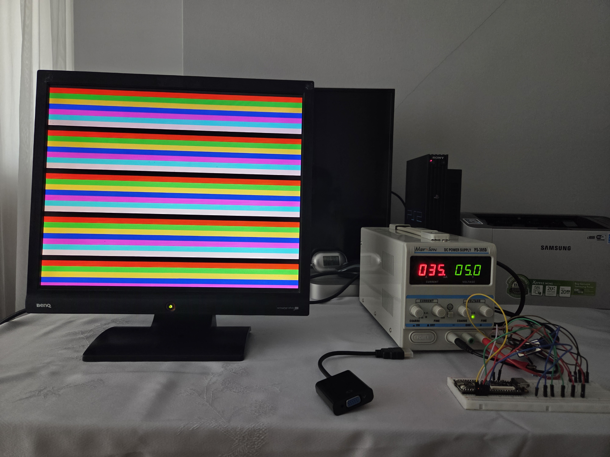
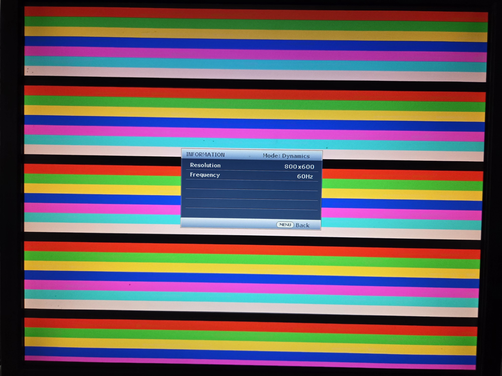

# VGA Signal Generator (Tang Nano 9K)
This is a project for generating a VGA signal (static image) with a resolution of 800x600 @ 60 Hz. The FPGA used is Tang Nano 9K from GOWIN Semiconductors.

 - Resolution: 800x600@60 Hz
 - Generated Image: 8 colored bars (in order: black, red, green, yellow, blue, magenta, cyan, white)
 - Current Draw: 35 mA
 - Voltage: 5V

# Photos
Circuit and the image on a monitor

Display information from the monitor

# Schematic
[View schematic](schematic.pdf)
